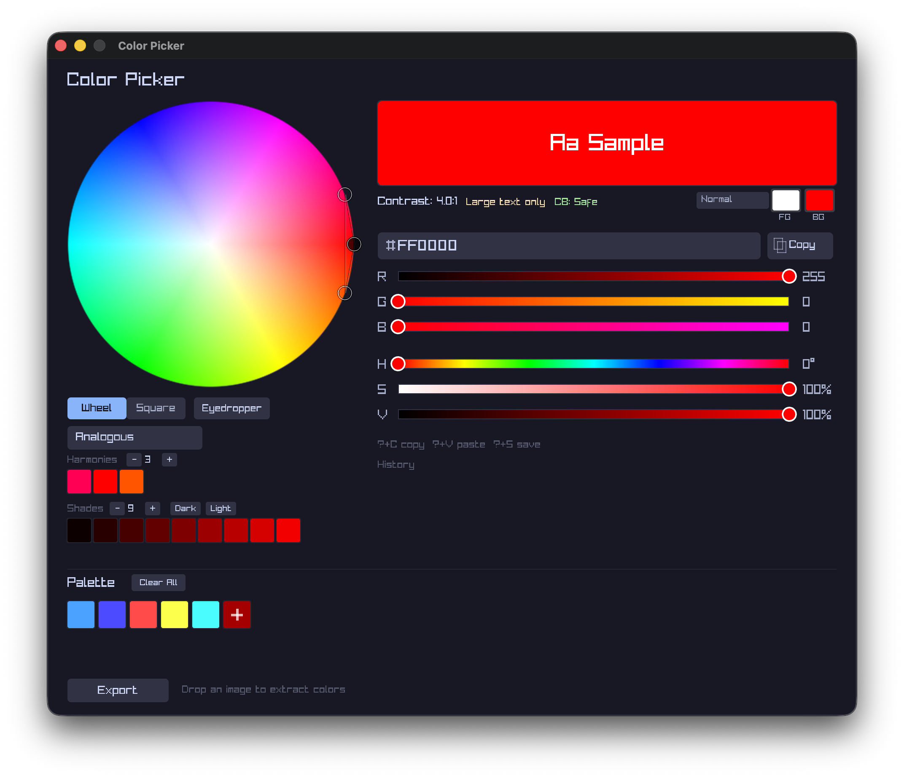

# Color Picker

A native desktop color picker built with [Odin](https://odin-lang.org/) and [Raylib](https://www.raylib.com/). Features a color wheel and square picker, RGB/HSV sliders, hex input, color harmony generation, WCAG contrast checking, color vision deficiency simulation, palette management, and image palette extraction.



## Table of Contents

- [Features](#features)
- [Requirements](#requirements)
- [Building](#building)
- [Running](#running)
- [Running Tests](#running-tests)
- [Keyboard Shortcuts](#keyboard-shortcuts)
- [Project Structure](#project-structure)
- [License](#license)

## Features

- **Dual picker modes** — color wheel and saturation/value square
- **RGB & HSV sliders** with direct hex input
- **Color harmonies** — analogous, complementary, triadic, split-complementary, square, compound, monochromatic, and shades
- **WCAG contrast checker** — foreground/background slots with AA/AAA ratings for normal and large text
- **Color vision deficiency simulation** — protanopia, deuteranopia, and tritanopia (Machado 2009 model)
- **Eyedropper** — pick any color from your screen (macOS `screencapture`, Linux via `grim`/`scrot`/`import`)
- **Image palette extraction** — extract dominant colors from an image via drag-and-drop using median cut
- **Palette management** — save, reorder (drag-and-drop), and persist palettes with undo support
- **Export** — ASE, GPL (GIMP), CSS custom properties, Tailwind config, JSON, PNG swatch strip, and plain text
- **Color history** — recent picks tracked automatically
- **Shade generation** — configurable shade count and value range

## Requirements

- [Odin compiler](https://odin-lang.org/docs/install/)
- Raylib (included with Odin's vendor collection)
- macOS 12+ or Linux

## Building

Build the binary:

```sh
./scripts/build.sh
```

Build an optimized release binary:

```sh
./scripts/build.sh --release
```

Build with an embedded version string:

```sh
./scripts/build.sh --release --version 1.2.3
```

Create a distributable package (macOS `.app` + `.dmg`, Linux `.deb`):

```sh
./scripts/bundle.sh --version 1.2.0
```

The `ODIN` environment variable can point to your Odin compiler if it isn't on `$PATH`:

```sh
ODIN=/usr/local/bin/odin ./scripts/build.sh
```

## Running

```sh
./bin/color_picker
```

Show the version:

```sh
./bin/color_picker --version
```

Enable verbose logging:

```sh
./bin/color_picker --verbose
```

## Running Tests

```sh
./scripts/test.sh
```

This runs the test suites for `src/color/`, `src/data/`, and `src/ui/layout/`.

## Keyboard Shortcuts

| Shortcut | Action |
|---|---|
| `Cmd+C` | Copy hex to clipboard |
| `Cmd+S` / `Space` | Add current color to palette |
| `Cmd+Z` | Undo last palette operation |
| `Cmd+E` | Toggle export panel |
| `Cmd+D` | Cycle CVD simulation mode |
| `Cmd+I` | Activate eyedropper |
| `Tab` / `Shift+Tab` | Cycle harmony type |
| `Escape` | Cancel eyedropper / close modal |

## Project Structure

The codebase is organized into three subpackages plus the root application package:

```
color_picker/
├── src/
│   ├── main.odin         Entry point, main loop, file drops
│   ├── input.odin         Delegated input handlers
│   ├── draw.odin          All rendering
│   ├── app_state.odin     Application state and orchestration
│   ├── app_layout.odin    Layout tree construction
│   ├── color/             Pure color math (package color)
│   ├── ui/                Theme, widgets (package ui)
│   │   └── layout/        Layout engine (package layout)
│   └── data/              Persistence, export, OS integration (package data)
├── scripts/
│   ├── build.sh           Build the binary
│   ├── test.sh            Run all test suites
│   └── bundle.sh          Create distributable packages
└── .github/workflows/
    ├── ci.yml             CI: test + build on push/PR
    └── release.yml        Release: build, package, publish on tag
```

### `color/` — Color math

| File | Purpose |
|---|---|
| `color.odin` | Core color state (HSV/RGB conversion, getters/setters) |
| `hex.odin` | Hex string parsing and formatting |
| `harmony.odin` | Color harmony computation |
| `shade.odin` | Shade strip generation |
| `contrast.odin` | WCAG relative luminance and contrast ratio |
| `colorblind.odin` | CVD simulation matrices and distinguishability checks |

### `ui/` — User interface

| File | Purpose |
|---|---|
| `theme.odin` | UI color theme constants (Catppuccin Mocha) |
| `button.odin` | Button and toggle components |
| `slider.odin` | Color slider component |
| `dropdown.odin` | Dropdown select component |
| `text_input.odin` | Text input with hex filter, undo, clipboard |
| `modal.odin` | Modal overlay component |
| `swatch.odin` | Color swatch row rendering |
| `stepper.odin` | Numeric stepper component |
| `wheel.odin` | HSV color wheel and SV square image generation |
| `util.odin` | Utility helpers |
| `layout/layout.odin` | Declarative layout engine (Fixed, Fill, Percent, Fit) |

### `data/` — Data and persistence

| File | Purpose |
|---|---|
| `history.odin` | Circular buffer color history |
| `palette.odin` | Palette add/remove/reorder and file persistence |
| `export.odin` | Palette export (ASE, GPL, CSS, Tailwind, JSON, PNG, TXT) |
| `eyedropper.odin` | Screen capture for the eyedropper tool |
| `image_extract.odin` | Median-cut palette extraction from images |

## License

MIT License. See [LICENSE](LICENSE) for details.
